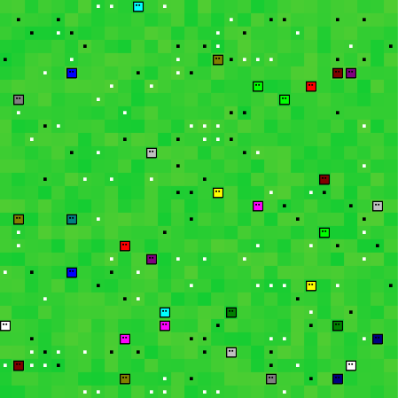

# The Game

The purpose of this repository is to explore different methods for creating Artificial Life.
Although this is typically done using some version of the genetic algorithm NEAT (e.g., 
RT-NEAT), I decided to look deeper into **Reinforcement Learning** due to its potential to learn
complex behavior. 

## Table of Contents  
<!--ts-->
   1. [Environment](#env)
        1. [Entities](#env-entities)
        2. [Movement](#env-movement)
   2. [Agents](#agents)
        1. [Actions](#agents-actions)
        2. [Brain](#agents-brain)
   3. [Reward](#reward)
   4. [Algorithms](#algorithms)
   100. [To Do](#todo)
<!--te-->

## 1. Environment

The basic environment is a numpy matrix of size *n* * *m* where each grid has a pixel size of *24* * *24*.
Due to the nature of numpy matrices, the coordinate system is different than your traditional coordinate system 
(see image below).

Each location within the matrix represents a location which can occupy only a single entity. 

#### Entities

Currently, there are two types of entities:
* Agents
* Food

`Agents` are the organisms that can move, eat, reproduce, and attack. 

Within the environment we can find two types of `food`:
* Good Food
    * Eating this food will increase your `health`
* Bad Food  
    * Eating this food will decrease your `health`
    
    

#### Movement

An entity can occupy any un-occupied space and, from that position, can move up, down, left or right. 
Entities cannot move diagonally. 

The environment has no walls, which means that if an entity moves left from the most left 
position in the numpy matrix, then it will move to the most right position. 

For example, if an entity is at position 4 (see image above) and it moves left, then it will
end up in position 6. In other words, the environment is a fully-connected world.  

**Complex Movement**  
Although the movement in itself is not complex, it becomes more difficult as multiple
entities want to move into the same spot. For that reason, each entity checks 
whether the target coordinate is unoccupied and if no other entity wants to move in that space. 
It does this iteratively as the target coordinate changes if an entity cannot move.    

---

##  2. Agents

Agents are entities or organism in the simulation that can move, attack, reproduce, 
etc. independently. The agents are the size of a single position/coordinate. They currently do not span multiple
coordinates. 

Each agent has the following characteristics:
* `Health`
    * Starts at 100 and decreases with 10 each step
* `Age`
    * Starts at 0 and increases 1 with each step  
* `Gen`
    * A gen is given to each entity simply representing an Int
    * It is given to its offspring when it reproduces
    * Any new agent that is not created through reproduction gets a new Int
    * This `gen` is represented by the color of the body
        * **NOTE**: This needs some rework as there is currently a limited set of colors    
    

#### Actions

An agent can perform the following actions:
* Move one space left, right, up, or down
    * They cannot move diagonally 
* Attack in the left, right, up, or down direction
    * Each attack decreases the health of the other agent with 50 

#### Brain

The agent learns behavior through Reinforcement Learning. The agent learns continuously
during its lifetime. When the agents dies, the algorithm recognizes it as the end of an 
episode. 

When a new entity is reproduced, it inherits its brain (RL-algorithm) from its parent. 

When a new entity is produced, it inherits its brain (RL-algorithm) from the best
entity we have seen so far. 

---

##  3. Reward

The reward structure is tricky as you want to minimize the amount you steer
the entity towards certain behavior. For that reason, I've adopted a simple and 
straightforward fitness measure, namely: 

It gets a score of -400 if the entity dies and receives a combined score
each step its alive. That reward is calculated as follows: 

reward = sum([other_agent.health / max_age for other_agent in self.agents if agent.gen == other_agent.gen])

Thus, it simply sums the health of all agents (including itself) at each step. 
The result is that its behavior is steered towards surviving as long as possible
while keeping its kin alive.   

---

## 4. Algorithms

Currently, the following algorithms are implemented that can be used as brains:
* DQN
* PER-DQN
* A2C

NOTE: PPO is implemented but is extremely unstable which is likely due to some 
issues with the implementation itself. Therefore, it is not recommeded to use it.  

---

## 5. To do

### Major
When creating a new entity, the best agents brain is chosen. The problem with that is that the
best agent could be by accident and therefore it is difficult to keep training. 

Methods:
* Choose the most recent brain that died
* Choose the best brain from the last X episodes
* Choose one brain that is currently in play
* Choose between the top 5 brains

### Minor
* Update fitness from sum of health to sum of age
* Communicate the actions of kin within fov to each other
* Strangely enough, it keeps on training at a certain moment...
* Train in google colab
* When initiating an attack, turn border red
* Dark entities have white eyes
* The best agents brain is saved, but that should be the most recent brain instead...
* When creating a new entity, simply the best agents brain is chosen.
    * I would like to keep track of the top 5 and most recent 5 and randomly select one
    * Maybe remove the lowest of the top 5 when adding a better one
* Add more algorithms (PPO, SAC, Rainbow, etc.)
* Include evolutionary traits
* Add more behavior
* Add more different entities to interact with 
* Create a nicer interface for the application 
* New entities through reproduction are put randomly on the map 
which should be within an entities fov
* Train on google coloboratory for (hopefully) a speed-up
* Save brains
* Load brains + Screensaver mode 
* Train different type of brains together

NOTE: The environment needs to be at least 7x7 otherwise it gives issues with
the fov. 

<!---
Font logo: https://www.1001fonts.com/fff-forward-font.html
-->