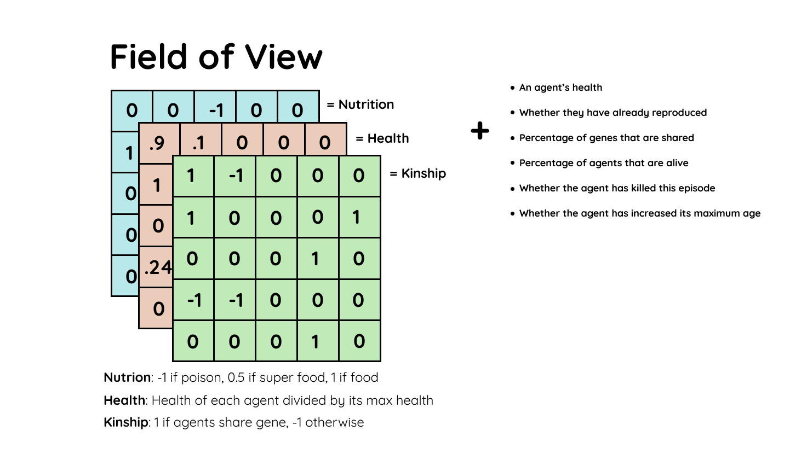
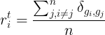
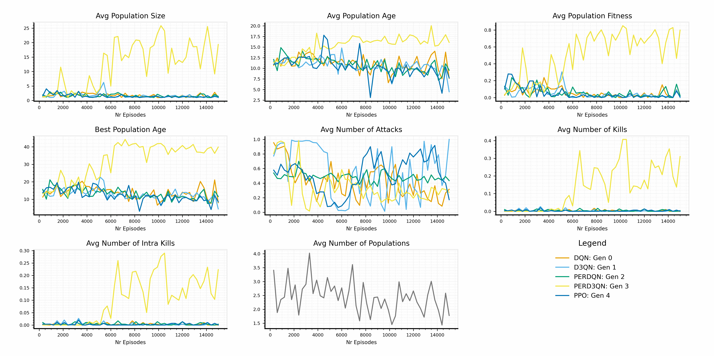

> Code and instructions for creating Artificial Life in a non-traditional 
way, namely with Reinforcement Learning instead of Evolutionary Algorithms. 

Although Evolutionary Algorithms have shown to result in interesting behavior,
they focus on learning across generations whereas behavior could also be learned
during ones lifetime. This is where Reinforcement Learning comes in, which 
learns through a reward/punishment system that allows it to learn new behavior
during its live time. Using Reinforcement Learning, entities learn to survive, 
reproduce, and make sure to maximize the fitness of their kin. 

<p float="left">
  
  
</p>


## Table of Contents  
<a name="toc"/></a>
<!--ts-->
   1. [About the Project](#about)
   2. [Getting Started](#gettingstarted)  
        2.1. [Prerequisites](#prerequisites)  
        2.2. [Usage](#usage)   
        2.3. [Google Colaboratory](#colab)  
   3. [Environment](#env)  
        3.1. [Agents](#env-agents)  
        3.2. [Observation](#env-observation)  
        3.3. [Reward](#env-reward)  
        3.4. [Algorithms](#env-algorithms)  
   4. [Results](#results)  
   5. [Documentation](#documentation)  
        5.1. [Training](#doc-training)  
        5.2. [Testing](#doc-testing)  
<!--te-->

---
<a name="about"/></a>
## 1. About the Project
[Back to ToC](#toc)  
The simulation above is a good summary of what this project is about. 
Entities move and learn independently, eat, attack other entities, and reproduce. 
This is all possible by applying Reinforcement Learning algorithms to each
entity, such as 
<a href="https://www.cs.toronto.edu/~vmnih/docs/dqn.pdf">DQN</a> and 
<a href="https://arxiv.org/pdf/1707.06347.pdf">PPO</a>. 

The general principle is simple, each entity starts by randomly executing
some actions and will slowly learn, based on specific rewards, whether 
those actions helped or not. The entity is punished if the action is poor and
rewarded if it was helpful. 

It is then up to the entities to find a way to survive as long as possible while 
also making sure their kin is in good shape as possible. 

---
<a name="gettingstarted"/></a>
##  2. Getting Started
[Back to ToC](#toc)  

To get started, you will only need to install the requirements and 
fork/download the ReinLife package, together with the train.py and
test.py files. 

<a name="prerequisites"/></a>
###  2.1. Prerequisites
To install the requirements, simply run the following:  
```pip install -r requirements.txt```

<a name="usage"/></a>
###  2.2. Usage

Due to the many parameters within each model and the environment itself, 
it is advised to start with train.py and test.py. These files have been 
prepared such that you can run them as is.  

#### Training
To train one or models, simply run:
```python
from ReinLife.Models import PERD3QN
from ReinLife.Helpers import trainer

brains = [PERD3QN(), 
          PERD3QN()]

trainer(brains, n_episodes=15_000, update_interval=300, width=30, height=30, max_agents=100,
        visualize_results=True, print_results=False, static_families=False, training=True, save=True)
``` 
This will start training the models for 15_000 episodes. The most important variable
here is `static_families`. If this is set to True, then there will be at most as
many genes as the number of brains chosen. Thus, you will only see two colors.
If you set this to False, then any number of genes will be created each with 
their own brain. 

#### Testing
To test one or models, simply run:
```python
from ReinLife import tester
from ReinLife.Models import DQN, D3QN, PERD3QN, PPO, PERDQN

main_brains = [PPO(load_model="pretrained/PPO/PPO/brain_gene_0.pt"),
               DQN(load_model="pretrained/DQN/DQN/brain_gene_0.pt", training=False),
               D3QN(load_model="pretrained/D3QN/D3QN/brain_gene_0.pt", training=False),
               PERD3QN(load_model="pretrained/PERD3QN/Static Families/PERD3QN/brain_gene_1.pt", training=False),
               PERDQN(load_model="pretrained/PERDQN/PERDQN/brain_gene_1.pt", training=False)]
tester(main_brains, width=30, height=30, max_agents=100, static_families=True, fps=10)
``` 
The models above are pre-trained (see results below).  
You can choose any number of brains that you have trained previously. Note,
make sure to set all models (except PPO) to training=False, otherwise it will
demonstrate more random behavior.
  
<a name="colab"/></a>
### 2.3. Google Colaboratory
It is possible to run the training code in google colaboratory if you need
more computing power. You start by installing pygame and cloning the repo:

```jupyter
!pip install pygame
!git clone https://github.com/MaartenGr/ReinLife.git
%cd ReinLife
```

After that, you are ready to run the training code: 
```python
from ReinLife.Models import PERD3QN
from ReinLife.Helpers import trainer

n_episodes = 15_000

brains = [PERD3QN(train_freq=10), PERD3QN(train_freq=10)]

env = trainer(brains, n_episodes=n_episodes, update_interval=300, width=30, height=30, max_agents=100,
        visualize_results=True, print_results=False, google_colab=True, render=False, static_families=True,
        training=True, save=True)
```

Then, simply look at the files on the left in ReinLife/experiments/... to 
find the experiment that was run. 

---
<a name="env"/></a>
##  3. Environment
[Back to TOC](#toc)

The environment is build upon a numpy matrix of size `n` * `m` where
each grid has a pixel size of 24 by 24. Each location within the matrix 
represents a location which can be occupied by only a single entity.

<a name="env-agents"/></a>
### 3.1. Agents 

Agents are entities or organisms in the simulation that can move, attack, 
reproduce, and act independently. 

Each agent has the following characteristics:
* `Health`
    * Starts at 200 and decreases with 10 each step
    * Their health cannot exceed 200 
* `Age`
    * Starts at 0 and increases 1 with each step  
    * Their maximum age is 50, after which they die
* `Gene`
    * Each agents is given a gene, which simply represents an integer
    * All their offspring have the same gene value
    * Any new agent that is created not through reproduction gets a new value
    * This `gene` is represented by the color of the body    
    
An agent can perform one of the following **eight actions**:
* Move one space left, right, up, or down
* Attack in the left, right, up, or down direction 

The **order** of action execution is as follows:
* Attack -> Move -> Eat -> Reproduce

#### Movement
An agent can occupy any un-occupied space and, from that position, can move up, 
down, left or right. Entities cannot move diagonally. The environment has no walls, which means that if an entity moves left from the 
most left position in the numpy matrix, then it will move to the most right 
position. In other words, the environment is a fully-connected world.  

Although the movement in itself is not complex, it becomes more difficult as 
multiple entities want to move into the same spot. For that reason, each entity 
checks whether the target coordinate is unoccupied and if no other entity wants 
to move in that space. It does this iteratively as the target coordinate changes 
if an entity cannot move.    

#### Attacking 
An agent can attack in one of four directions:
* Up, Down, Left, or Right

They stand still if they attack. However, since it is the first thing they
do, the other agent cannot move away. When the agent successfully attacks 
another agent, the other agent dies and the attacker increases its health. 
Moreover, if the agent successfully attacks another agent, 
its **border** becomes **red**.

#### (Re)production
Each agent learns continuously during its lifetime. The end of an episode
is marked by the end of an agents life. 

When a new entity is **reproduced**, it inherits its brain (RL-algorithm)
from its parents. 

When a new entity is **produced**, it inherits its brain (RL-algorithm) from 
one of the best agents we have seen so far. A list of 10 of the best agents
is tracked during the simulation. 

<a name="env-observation"/></a>
### 3.2. Observation
The field of view of each agent is a square surrounding the agent. 
Since the world is fully-connected, the agent can see "through" walls.

The input for the neural network can be see in the image below:   

 

There are three grids of 7x7 (example shows 5x5) that each show a specific
observation of the environment: 
* `Health`
    * Shows the health of all agents within the agent's fov
* `Kinship`
    * Shows whether agents within the agent's fov are related to the agent
* `Nutrition`
    * Shows the nutritrional value of food items within the agent's fov

Thus, there are 3 * (7 * 7) + 6 = **153 input values**. 


<a name="env-reward"/></a>
###  3.3. Reward
The reward structure is tricky as you want to minimize the amount you steer
the entity towards certain behavior. For that reason, I've adopted a simple and 
straightforward fitness measure, namely: 

 

Where `r` is the reward given to agent `i` at time `t`. The `δ`
is the Kronecker delta which is one if the the gene of agent `i`, `gi`, equals
the gene of agent `j`, `gj`, and zero otherwise. `n` is the total number of
agents that are alive at time `t`. Thus, the reward essentially
checks how many agents are alive that share a gene with agent `i` at time
`t` and divides by the total number of agents alive. 

The result is that an agent's behavior is only steered towards making sure 
its gene lives on for as long as possible. 

<a name="env-algorithms"/></a>
### 3.4. Algorithms
Currently, the following algorithms are implemented that can be used as brains:
* Deep Q Network (DQN)
* Prioritized Experience Replay Deep Q Network (PER-DQN)
* Double Dueling Deep Q Network (D3QN)
* Prioritized Experience Replay Double Dueling Deep Q Network (PER-D3QN)
* Proximal Policy Optimization (PPO)

---
<a name="results"/></a>
## 4. Results
[Back to TOC](#toc)

In order to test the quality of the trained algorithms, I ran each
algorithm independently against a copy of itself to test the speed at which
they converge to a high fitness. Below, you can see all algorithms
battling it out with PER-D3QN coming out on top. Note, this does not mean
it is necessarily the best algorithm. It might have converged faster than 
others which limits their learning ability. 

 


Moreover, for each algorithm, I ran simulations with and without static families.   
### DQN
<details>
<summary>With static families</summary>

</details>

### PER-DQN
<details>
<summary>With static families</summary>

</details>

### D3QN
<details>
<summary>With static families</summary>

</details>

### PER-D3QN
<details>
<summary>With static families</summary>

</details>

<details>
<summary>With static families</summary>

</details>

### PPO
<details>
<summary>With static families</summary>

</details>

---
<a name="documentation"/></a>
## 5. Documentation
[Back to TOC](#toc)

<a name="doc-training"/></a>
### 5.1. Training

The parameters for **train.py**:

| Parameter                        | Description                              | Default value                  |
| :------------------------------- | :--------------------------------------- | :----------------------------- |
| brains | Contains a list of brains defined as Agents by the ReinLife.Models folder. ||
| n_episodes | The number of epsiodes to run the training sequence. | 10_000 |
| width, height | The width and height of the environment. | 30, 30 |
| visualize_results | Whether to visualize the results interactively in matplotlib.  | False |
| google_colab | If you want to visualize your results interactively in google_colab, also set this parameter to True as well as the one above.| False |
| update_interval | The interval at which average the results | 500 |
| print_results | Whether to print the results to the console | True |
| max_agents | The maximum number of agents can occupy the environment. | 100 |
| render | Whether to render the environment in pygame whilst training. | False |
| static_families | Whether you want a set number of families to be used. Each family has its own brain defined by the models in the variable brains. | False|
| training | Whether you want to train using the settings above or simply show the result. | True |
| limit_reproduction | If False, agents can reproduce indefinitely. If True, all agents can only reproduce once. | False |
| incentivize_killing | Whether to incentivize killing by adding 0.2 everytime an agent kills another | True |

<a name="doc-testing"/></a>
### 5.2. Testing

The parameters for **test.py**:

| Parameter                        | Description                              | Default value                  |
| :------------------------------- | :--------------------------------------- | :----------------------------- |
| brains | Contains a list of brains defined as Agents by the ReinLife.Models folder. ||
| width, height | The width and height of the environment. | 30, 30 |
| pastel_colors | Whether to automatically generate random pastel colors  | False |
| max_agents | The maximum number of agents can occupy the environment. | 100 |
| static_families | Whether you want a set number of families to be used. Each family has its own brain defined by the models in the variable brains. | False|
| limit_reproduction | If False, agents can reproduce indefinitely. If True, all agents can only reproduce once. | False |
| fps | Frames per second | 10 |


### Other work
ReinLife was based on:
* Abrantes, J. P., Abrantes, A. J., & Oliehoek, F. A. (2020). Mimicking Evolution with Reinforcement Learning. arXiv preprint arXiv:2004.00048.
