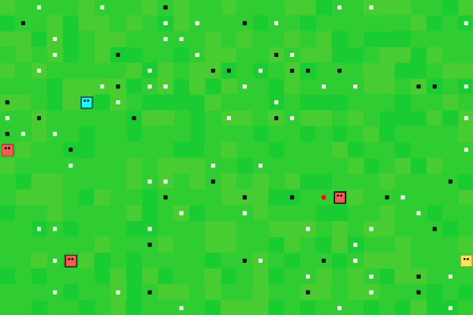
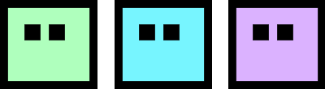

> Code and instructions for creating Artificial Life in a non-traditional 
way, namely with Reinforcement Learning instead of Evolutionary Algorithms. 

Although Evolutionary Algorithms have shown to result in interesting behavior,
they focus on learning across generations whereas behavior could also be learned
during ones lifetime. This is where Reinforcement Learning comes in, which 
learns through a reward/punishment system that allows it to learn new behavior
during its live time. Using Reinforcement Learning, entities learn to survive, 
reproduce, and make sure to maximize the fitness of their kin. 

## Table of Contents  
<!--ts-->
   1. [Overview](#overview)
   2. [Agents](#agents)
        1. [Actions](#agents-actions)
        2. [Movement](#agents-actions)
        3. [Brain](#agents-brain)
   3. [Reward](#reward)
   4. [Algorithms](#algorithms)
   4. [Evolution](#evolution)
   4. [Results](#results)
   4. [Code](#code)
   100. [To Do](#todo)
<!--te-->

## 1. Overview
Here, I will give a basic overview of the environment and how the simulation
works. Any in-depth descriptions will be shown in the sections below.  

In the simulation you can find entities moving independently, attacking other
entities, and reproducing if they are old enough. It is up to the entities to 
find a way to survive as long as possible while also making 
sure their kin is in good shape as possible. 

The environment is build upon a numpy matrix of size `n` * `m` where
each grid has a pixel size of 24 by 24. Each location within the matrix 
represents a location which can be occupied by only a single entity.  

In the animation above you can find the following objects:
  
   

* **Agents** can move, attack other entities, eat, and reproduce asexually.  
Their color indicates kinship between others with the same color. 
They have a health of 200 which decreases 10 with each action they take.  
* **White** blocks are food which increases an entity's health by 40.
* **Black** blocks are poison which decreases an entity's health by 40.
* **Red** blocks are especially helpful as they have the same properties as food but 
also multiplies an entity's maximum age by 1.2.  

##  2. Agents

Agents are entities or organisms in the simulation that can move, attack, 
reproduce, and act independently. 

Each agent has the following characteristics:
* `Health`
    * Starts at 200 and decreases with 10 each step
    * Their health cannot exceed 200 
* `Age`
    * Starts at 0 and increases 1 with each step  
    * Their maximum age is 50, after which they die
* `Gene`
    * Each agents is given a gene, which simply represents an integer
    * All their offspring have the same gene value
    * Any new agent that is created not through reproduction gets a new value
    * This `gene` is represented by the color of the body    
    
An agent can perform one of the following **eight** actions:
* Move one space left, right, up, or down
* Attack in the left, right, up, or down direction 

The order of action execution is as follows:
* Attack
* Move
* Eat
* Reproduce

---

#### Movement

An agent can occupy any un-occupied space and, from that position, can move up, 
down, left or right. Entities cannot move diagonally. 

The environment has no walls, which means that if an entity moves left from the 
most left position in the numpy matrix, then it will move to the most right 
position. 

 

For example, if an entity is at position 4 (see image above) and it moves left, 
then it will end up in position 6. In other words, the environment is a 
fully-connected world.  

**Complex Movement**  
Although the movement in itself is not complex, it becomes more difficult as 
multiple entities want to move into the same spot. For that reason, each entity 
checks whether the target coordinate is unoccupied and if no other entity wants 
to move in that space. It does this iteratively as the target coordinate changes 
if an entity cannot move.    

---

#### Attacking

An agent can attack in one of four directions:
* Up
* Down
* Left
* Right

They stand still if they attack. However, since it is the first thing they
do, the other agent cannot move away. 

When the agent successfully attacks another agent, the other agent dies and
the attacker increases its health. Moreover, if the agent successfully
attacks another agent, its **border** becomes **red**.

---

#### Observation

 

---

#### Brain

The agent learns behavior through Reinforcement Learning. The agent learns continuously
during its lifetime. When the agents dies, the algorithm recognizes it as the end of an 
episode. 

When a new entity is reproduced, it inherits its brain (RL-algorithm) from its parent. 

When a new entity is produced, it inherits its brain (RL-algorithm) from the best
entity we have seen so far. 

---

##  3. Reward

The reward structure is tricky as you want to minimize the amount you steer
the entity towards certain behavior. For that reason, I've adopted a simple and 
straightforward fitness measure, namely: 

It gets a score of -400 if the entity dies and receives a combined score
each step its alive. That reward is calculated as follows: 

reward = sum([other_agent.health / max_age for other_agent in self.agents if agent.gen == other_agent.gen])

Thus, it simply sums the health of all agents (including itself) at each step. 
The result is that its behavior is steered towards surviving as long as possible
while keeping its kin alive.   

---

## 4. Algorithms

Currently, the following algorithms are implemented that can be used as brains:
* DQN
* PER-DQN
* A2C

NOTE: PPO is implemented but is extremely unstable which is likely due to some 
issues with the implementation itself. Therefore, it is not recommeded to use it.  

---

## 5. To do

### Major
When creating a new entity, the best agents brain is chosen. The problem with that is that the
best agent could be by accident and therefore it is difficult to keep training. 

Methods:
* Choose the most recent brain that died
* Choose the best brain from the last X episodes
* Choose one brain that is currently in play
* Choose between the top 5 brains

### Minor
* Update fitness from sum of health to sum of age
* Communicate the actions of kin within fov to each other
* Strangely enough, it keeps on training at a certain moment...
* Train in google colab
* When initiating an attack, turn border red
* Dark entities have white eyes
* The best agents brain is saved, but that should be the most recent brain instead...
* When creating a new entity, simply the best agents brain is chosen.
    * I would like to keep track of the top 5 and most recent 5 and randomly select one
    * Maybe remove the lowest of the top 5 when adding a better one
* Add more algorithms (PPO, SAC, Rainbow, etc.)
* Include evolutionary traits
* Add more behavior
* Add more different entities to interact with 
* Create a nicer interface for the application 
* New entities through reproduction are put randomly on the map 
which should be within an entities fov
* Train on google coloboratory for (hopefully) a speed-up
* Save brains
* Load brains + Screensaver mode 
* Train different type of brains together

NOTE: The environment needs to be at least 7x7 otherwise it gives issues with
the fov. 

<!---
Font logo: https://www.1001fonts.com/fff-forward-font.html
-->